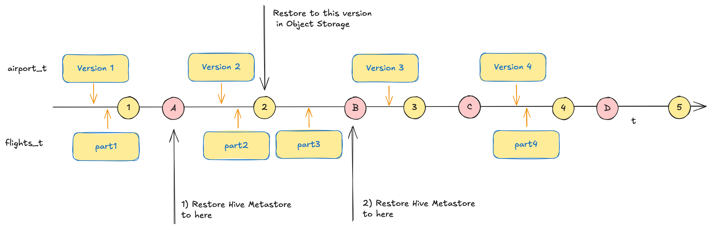

# Test Hive Metastore Backup & Restore

The following scenario will be tested by going through the steps documented below



## Preparation of environment


```bash
cd $DATAPLATFORM_HOME
sudo rm -R backup
mkdir -p backup

docker compose down
docker volume prune -f

rm -R container-volume/minio/*
docker compose up -d
```

wait until Minio is available

```bash
docker exec -ti minio-mc mc rb minio-1/flight-bucket --force

docker exec -ti minio-mc mc mb minio-1/flight-bucket
docker exec -ti minio-mc mc version enable minio-1/flight-bucket

# verify that versioning works
docker exec -ti minio-mc mc version info minio-1/flight-bucket
```

Create the Kafka Audit Log topic

```bash
docker exec -ti kafka-1 kafka-topics --create --bootstrap-server kafka-1:19092 --topic minio-audit-log
docker exec -ti kafka-1 kafka-topics --create --bootstrap-server kafka-1:19092 --topic hms.notification.v1
```

```bash
cd $PYTEST_HOME
python -m venv venv
source venv/bin/activate.fish

pip3 install -r requirements.txt
```

## Handle period 0

```bash
cd $PYTEST_HOME
pytest src/hms_backup_restore_0.py --verbose
```

```bash
===================================================================================== test session starts ======================================================================================
platform darwin -- Python 3.12.10, pytest-8.4.1, pluggy-1.6.0 -- /Users/guido.schmutz/Documents/GitHub/gschmutz/hms-restore-test/hms-backup-restore/venv/bin/python3.12
cachedir: .pytest_cache
metadata: {'Python': '3.12.10', 'Platform': 'macOS-15.5-arm64-arm-64bit', 'Packages': {'pytest': '8.4.1', 'pluggy': '1.6.0'}, 'Plugins': {'html': '4.1.1', 'metadata': '3.1.1', 'md': '0.2.0', 'order': '1.3.0'}}
rootdir: /Users/guido.schmutz/Documents/GitHub/gschmutz/hms-restore-test/hms-backup-restore
plugins: html-4.1.1, metadata-3.1.1, md-0.2.0, order-1.3.0
collected 8 items                                                                                                                                                                              

src/hms_backup_restore_0.py::test_create_schema PASSED                                                                                                                                   [ 12%]
src/hms_backup_restore_0.py::test_create_airport_table PASSED                                                                                                                            [ 25%]
src/hms_backup_restore_0.py::test_create_flights_table PASSED                                                                                                                            [ 37%]
src/hms_backup_restore_0.py::test_airport_counts PASSED                                                                                                                                  [ 50%]
src/hms_backup_restore_0.py::test_flights_counts PASSED                                                                                                                                  [ 62%]
src/hms_backup_restore_0.py::test_notifications PASSED                                                                                                                                   [ 75%]
src/hms_backup_restore_0.py::test_airport_counts_after PASSED                                                                                                                            [ 87%]
src/hms_backup_restore_0.py::test_flights_counts_after PASSED                                                                                                                            [100%]
```

## Handle period 1

```bash
pytest src/hms_backup_restore_1.py --verbose
```

**Backup Minio**

```bash
cp -R ../platys-hms/container-volume/minio/ ../platys-hms/backup/1
```

## Handle period 2

```bash
pytest src/hms_backup_restore_2.py --verbose
```

**Backup Minio**

```bash
cp -R ../platys-hms/container-volume/minio/ ../platys-hms/backup/2
```

## Handle period 3

```bash
pytest src/hms_backup_restore_3.py --verbose
```

**Backup Minio**

```bash
cp -R ../platys-hms/container-volume/minio/ ../platys-hms/backup/3
```


## Handle period 4

```bash
pytest src/hms_backup_restore_4.py --verbose
```

**Backup Minio**

```bash
cp -R ../platys-hms/container-volume/minio/ ../platys-hms/backup/4
```

## Handle Period 5

```bash
pytest src/hms_backup_restore_5.py --verbose
```


```bash
docker cp hive-metastore-db:/hms-A.dump ../platys-hms/backup
docker cp hive-metastore-db:/hms-B.dump ../platys-hms/backup
docker cp hive-metastore-db:/hms-C.dump ../platys-hms/backup
docker cp hive-metastore-db:/hms-D.dump ../platys-hms/backup
```

## Rollback Minio to end of Period 2

Let's rollback MinIO to the backup of the end Period 2


```bash
cd $DATAPLATFORM_HOME
docker stop minio-1 && docker rm minio-1

rm -R container-volume/minio/*
cp -R backup/2/* container-volume/minio

docker compose up -d
cd $PYTEST_HOME
```

List the versions of an object

```bash
docker exec -ti minio-mc mc ls --versions minio-1/flight-bucket/raw/airports
```

```bash
guido.schmutz@AMAXDKFVW0HYY ~/D/G/g/h/platys-hms (main)> docker exec -ti minio-mc mc ls --versions minio-1/flight-bucket/raw/airports
[2025-07-07 08:29:47 UTC]     0B STANDARD null v1 PUT /
[2025-07-07 08:50:20 UTC]     0B STANDARD 475982d3-abe6-4206-af9c-357aac83c9ed v2 DEL airports-1.csv
[2025-07-07 08:49:16 UTC] 136KiB STANDARD 487b5784-dfd9-4b78-8be6-d2f97788433b v1 PUT airports-1.csv
[2025-07-07 08:50:20 UTC] 169KiB STANDARD f5079641-c447-40a1-9e85-e34fda67b2ad v1 PUT airports-2.csv
```

```bash
docker exec -ti minio-mc mc tree --files  minio-1/flight-bucket/refined/flights
```

```bash
guido.schmutz@AMAXDKFVW0HYY ~/D/G/g/h/platys-hms (main)> docker exec -ti minio-mc mc tree --files  minio-1/flight-bucket/refined/flights
minio-1/flight-bucket/refined/flights
├─ 
│  └─ year=2008
│     ├─ month=1
│     │  ├─ part-00000-8e3379b7-ffe4-4904-a252-c471bf253208.c000.snappy.parquet
│     │  ├─ part-00001-8e3379b7-ffe4-4904-a252-c471bf253208.c000.snappy.parquet
│     │  ├─ part-00002-8e3379b7-ffe4-4904-a252-c471bf253208.c000.snappy.parquet
│     │  ├─ part-00003-8e3379b7-ffe4-4904-a252-c471bf253208.c000.snappy.parquet
│     │  ├─ part-00004-8e3379b7-ffe4-4904-a252-c471bf253208.c000.snappy.parquet
│     │  ├─ part-00005-8e3379b7-ffe4-4904-a252-c471bf253208.c000.snappy.parquet
│     │  ├─ part-00006-8e3379b7-ffe4-4904-a252-c471bf253208.c000.snappy.parquet
│     │  ├─ part-00007-8e3379b7-ffe4-4904-a252-c471bf253208.c000.snappy.parquet
│     │  ├─ part-00008-8e3379b7-ffe4-4904-a252-c471bf253208.c000.snappy.parquet
│     │  └─ part-00009-8e3379b7-ffe4-4904-a252-c471bf253208.c000.snappy.parquet
│     └─ month=2
│        ├─ part-00000-2b462dad-0a94-47a4-81fa-6115c3f7d62f.c000.snappy.parquet
│        ├─ part-00001-2b462dad-0a94-47a4-81fa-6115c3f7d62f.c000.snappy.parquet
│        ├─ part-00002-2b462dad-0a94-47a4-81fa-6115c3f7d62f.c000.snappy.parquet
│        ├─ part-00003-2b462dad-0a94-47a4-81fa-6115c3f7d62f.c000.snappy.parquet
│        ├─ part-00004-2b462dad-0a94-47a4-81fa-6115c3f7d62f.c000.snappy.parquet
│        ├─ part-00005-2b462dad-0a94-47a4-81fa-6115c3f7d62f.c000.snappy.parquet
│        ├─ part-00006-2b462dad-0a94-47a4-81fa-6115c3f7d62f.c000.snappy.parquet
│        ├─ part-00007-2b462dad-0a94-47a4-81fa-6115c3f7d62f.c000.snappy.parquet
│        ├─ part-00008-2b462dad-0a94-47a4-81fa-6115c3f7d62f.c000.snappy.parquet
│        └─ part-00009-2b462dad-0a94-47a4-81fa-6115c3f7d62f.c000.snappy.parquet
└─ year=2008
   ├─ month=1
   │  ├─ part-00000-8e3379b7-ffe4-4904-a252-c471bf253208.c000.snappy.parquet
   │  ├─ part-00001-8e3379b7-ffe4-4904-a252-c471bf253208.c000.snappy.parquet
   │  ├─ part-00002-8e3379b7-ffe4-4904-a252-c471bf253208.c000.snappy.parquet
   │  ├─ part-00003-8e3379b7-ffe4-4904-a252-c471bf253208.c000.snappy.parquet
   │  ├─ part-00004-8e3379b7-ffe4-4904-a252-c471bf253208.c000.snappy.parquet
   │  ├─ part-00005-8e3379b7-ffe4-4904-a252-c471bf253208.c000.snappy.parquet
   │  ├─ part-00006-8e3379b7-ffe4-4904-a252-c471bf253208.c000.snappy.parquet
   │  ├─ part-00007-8e3379b7-ffe4-4904-a252-c471bf253208.c000.snappy.parquet
   │  ├─ part-00008-8e3379b7-ffe4-4904-a252-c471bf253208.c000.snappy.parquet
   │  └─ part-00009-8e3379b7-ffe4-4904-a252-c471bf253208.c000.snappy.parquet
   └─ month=2
      ├─ part-00000-2b462dad-0a94-47a4-81fa-6115c3f7d62f.c000.snappy.parquet
      ├─ part-00001-2b462dad-0a94-47a4-81fa-6115c3f7d62f.c000.snappy.parquet
      ├─ part-00002-2b462dad-0a94-47a4-81fa-6115c3f7d62f.c000.snappy.parquet
      ├─ part-00003-2b462dad-0a94-47a4-81fa-6115c3f7d62f.c000.snappy.parquet
      ├─ part-00004-2b462dad-0a94-47a4-81fa-6115c3f7d62f.c000.snappy.parquet
      ├─ part-00005-2b462dad-0a94-47a4-81fa-6115c3f7d62f.c000.snappy.parquet
      ├─ part-00006-2b462dad-0a94-47a4-81fa-6115c3f7d62f.c000.snappy.parquet
      ├─ part-00007-2b462dad-0a94-47a4-81fa-6115c3f7d62f.c000.snappy.parquet
      ├─ part-00008-2b462dad-0a94-47a4-81fa-6115c3f7d62f.c000.snappy.parquet
      └─ part-00009-2b462dad-0a94-47a4-81fa-6115c3f7d62f.c000.snappy.parquet
```

* if on **Hive Metastore < 4.0.1**

```bash
docker exec -ti hive-metastore hive -e 'SHOW PARTITIONS flight_db.flights_t;'
```

```bash
guido.schmutz@AMAXDKFVW0HYY ~/w/platys-hms> docker exec -ti hive-metastore hive -e 'SHOW PARTITIONS flight_db.flights_t;'
SLF4J: Class path contains multiple SLF4J bindings.
SLF4J: Found binding in [jar:file:/opt/hive/lib/log4j-slf4j-impl-2.17.1.jar!/org/slf4j/impl/StaticLoggerBinder.class]
SLF4J: Found binding in [jar:file:/opt/hadoop/share/hadoop/common/lib/slf4j-log4j12-1.7.25.jar!/org/slf4j/impl/StaticLoggerBinder.class]
SLF4J: See http://www.slf4j.org/codes.html#multiple_bindings for an explanation.
SLF4J: Actual binding is of type [org.apache.logging.slf4j.Log4jLoggerFactory]
Hive Session ID = 7452bd69-b2d4-4094-9de8-e8293130d799

Logging initialized using configuration in file:/opt/hive/conf/hive-log4j2.properties Async: true
Hive Session ID = b063d497-a906-4d85-b4b2-db0682ff10e0
OK
year=2008/month=1
year=2008/month=2
year=2008/month=3
year=2008/month=4
Time taken: 1.006 seconds, Fetched: 4 row(s)
```

A repair shows the 2 partitions which do no exists at the end of Period 2.

```bash
docker exec -ti hive-metastore hive -e 'MSCK REPAIR TABLE flight_db.flights_t;'
```

```
guido.schmutz@AMAXDKFVW0HYY ~/w/platys-hms> docker exec -ti hive-metastore hive -e 'MSCK REPAIR TABLE flight_db.flights_t;'
SLF4J: Class path contains multiple SLF4J bindings.
SLF4J: Found binding in [jar:file:/opt/hive/lib/log4j-slf4j-impl-2.17.1.jar!/org/slf4j/impl/StaticLoggerBinder.class]
SLF4J: Found binding in [jar:file:/opt/hadoop/share/hadoop/common/lib/slf4j-log4j12-1.7.25.jar!/org/slf4j/impl/StaticLoggerBinder.class]
SLF4J: See http://www.slf4j.org/codes.html#multiple_bindings for an explanation.
SLF4J: Actual binding is of type [org.apache.logging.slf4j.Log4jLoggerFactory]
Hive Session ID = d8d1a525-007e-476b-a29d-08d501e98b56

Logging initialized using configuration in file:/opt/hive/conf/hive-log4j2.properties Async: true
Hive Session ID = f3da186c-a690-44a4-a2bb-a3be1fe55bba
OK
Partitions missing from filesystem:	flights_t:year=2008/month=3	flights_t:year=2008/month=4
Time taken: 2.605 seconds, Fetched: 1 row(s)
```

* if on **Hive Metastore 4.0.1**

or through hive-server if on **Hive Metastore 4.0.1**

```bash
docker exec -ti hive-server beeline -u jdbc:hive2://hive-server:10000 -e "SHOW PARTITIONS flight_db.flights_t;"
```

```bash
docker exec -ti hive-server beeline -u jdbc:hive2://hive-server:10000 -e "SHOW PARTITIONS flight_db.flights_t;"
INFO  : Compiling command(queryId=hive_20250703085508_7c57cc71-bf87-4e12-9014-12c1d5d25809): SHOW PARTITIONS flight_db.flights_t
INFO  : Concurrency mode is disabled, not creating a lock manager
INFO  : Semantic Analysis Completed (retrial = false)
INFO  : Returning Hive schema: Schema(fieldSchemas:[FieldSchema(name:partition, type:string, comment:from deserializer)], properties:null)
INFO  : Completed compiling command(queryId=hive_20250703085508_7c57cc71-bf87-4e12-9014-12c1d5d25809); Time taken: 0.285 seconds
INFO  : Concurrency mode is disabled, not creating a lock manager
INFO  : Executing command(queryId=hive_20250703085508_7c57cc71-bf87-4e12-9014-12c1d5d25809): SHOW PARTITIONS flight_db.flights_t
INFO  : Starting task [Stage-0:DDL] in serial mode
INFO  : Completed executing command(queryId=hive_20250703085508_7c57cc71-bf87-4e12-9014-12c1d5d25809); Time taken: 0.056 seconds
INFO  : OK
INFO  : Concurrency mode is disabled, not creating a lock manager
+--------------------+
|     partition      |
+--------------------+
| year=2008/month=1  |
| year=2008/month=2  |
| year=2008/month=3  |
| year=2008/month=4  |
+--------------------+
4 rows selected (0.823 seconds)
```

if we use Trino to sync partition metadata with the `FULL` option, the no-existing partitions are removed

```bash
docker exec -ti trino-cli trino --server http://trino-1:8080  --user trino --execute "call minio.system.sync_partition_metadata('flight_db', 'flights_t', 'FULL')"
```

Which we can check by rerunning the `SHOW PARTITIONS` command again

```bash
docker exec -ti hive-server beeline -u jdbc:hive2://hive-server:10000 -e "SHOW PARTITIONS flight_db.flights_t;"
```

```bash
guido.schmutz@AMAXDKFVW0HYY ~/D/G/g/h/platys-hms (main)> docker exec -ti hive-server beeline -u jdbc:hive2://hive-server:10000 -e "SHOW PARTITIONS flight_db.flights_t;"

SLF4J: Class path contains multiple SLF4J bindings.
SLF4J: Found binding in [jar:file:/opt/hive/lib/log4j-slf4j-impl-2.17.1.jar!/org/slf4j/impl/StaticLoggerBinder.class]
SLF4J: Found binding in [jar:file:/opt/hadoop/share/hadoop/common/lib/slf4j-log4j12-1.7.25.jar!/org/slf4j/impl/StaticLoggerBinder.class]
SLF4J: See http://www.slf4j.org/codes.html#multiple_bindings for an explanation.
SLF4J: Actual binding is of type [org.apache.logging.slf4j.Log4jLoggerFactory]
Connecting to jdbc:hive2://hive-server:10000
Connected to: Apache Hive (version 3.1.3)
Driver: Hive JDBC (version 3.1.3)
Transaction isolation: TRANSACTION_REPEATABLE_READ
INFO  : Compiling command(queryId=hive_20250703085845_df5b167a-cae5-432d-abbe-ff3a1951e891): SHOW PARTITIONS flight_db.flights_t
INFO  : Concurrency mode is disabled, not creating a lock manager
INFO  : Semantic Analysis Completed (retrial = false)
INFO  : Returning Hive schema: Schema(fieldSchemas:[FieldSchema(name:partition, type:string, comment:from deserializer)], properties:null)
INFO  : Completed compiling command(queryId=hive_20250703085845_df5b167a-cae5-432d-abbe-ff3a1951e891); Time taken: 0.066 seconds
INFO  : Concurrency mode is disabled, not creating a lock manager
INFO  : Executing command(queryId=hive_20250703085845_df5b167a-cae5-432d-abbe-ff3a1951e891): SHOW PARTITIONS flight_db.flights_t
INFO  : Starting task [Stage-0:DDL] in serial mode
INFO  : Completed executing command(queryId=hive_20250703085845_df5b167a-cae5-432d-abbe-ff3a1951e891); Time taken: 0.032 seconds
INFO  : OK
INFO  : Concurrency mode is disabled, not creating a lock manager
+--------------------+
|     partition      |
+--------------------+
| year=2008/month=1  |
| year=2008/month=2  |
+--------------------+
2 rows selected (0.244 seconds)
Beeline version 3.1.3 by Apache Hive
[WARN] Failed to create directory: /home/hive/.beeline
No such file or directory
Closing: 0: jdbc:hive2://hive-server:10000
```

## Rollback HMS to Snapshot A

```bash
cd $DATAPLATFORM_HOME
docker stop hive-metastore-db && docker rm hive-metastore-db

docker compose up -d
```

```bash
docker cp backup/hms-A.dump hive-metastore-db:/
docker exec -i hive-metastore-db pg_restore -U hive -d metastore_db /hms-A.dump
```

```bash
docker restart hive-metastore
cd $PYTEST_HOME
```

* if on **Hive Metastore < 4.0.1**

```
docker exec -ti hive-metastore hive -e 'show partitions flight_db.flights_t;'
```

```bash
guido.schmutz@AMAXDKFVW0HYY ~/w/platys-hms> docker exec -ti hive-metastore hive -e 'show partitions flight_db.flights_t;'
SLF4J: Class path contains multiple SLF4J bindings.
SLF4J: Found binding in [jar:file:/opt/hive/lib/log4j-slf4j-impl-2.17.1.jar!/org/slf4j/impl/StaticLoggerBinder.class]
SLF4J: Found binding in [jar:file:/opt/hadoop/share/hadoop/common/lib/slf4j-log4j12-1.7.25.jar!/org/slf4j/impl/StaticLoggerBinder.class]
SLF4J: See http://www.slf4j.org/codes.html#multiple_bindings for an explanation.
SLF4J: Actual binding is of type [org.apache.logging.slf4j.Log4jLoggerFactory]
Hive Session ID = 49637913-9e6e-4448-922f-cc6a61647e6a

Logging initialized using configuration in file:/opt/hive/conf/hive-log4j2.properties Async: true
Hive Session ID = 0bae7e39-df60-4e6d-bd49-1df68e9aa164
OK
year=2008/month=1
Time taken: 1.205 seconds, Fetched: 1 row(s)
```

* if on **Hive Metastore 4.0.1**

```bash
docker exec -ti hive-server beeline -u jdbc:hive2://hive-server:10000 -e "SHOW PARTITIONS flight_db.flights_t;"
```

```bash
INFO  : Compiling command(queryId=hive_20250703090241_8c82da32-c9e5-49c1-bd42-ca6836a28301): SHOW PARTITIONS flight_db.flights_t
INFO  : Concurrency mode is disabled, not creating a lock manager
INFO  : Semantic Analysis Completed (retrial = false)
INFO  : Returning Hive schema: Schema(fieldSchemas:[FieldSchema(name:partition, type:string, comment:from deserializer)], properties:null)
INFO  : Completed compiling command(queryId=hive_20250703090241_8c82da32-c9e5-49c1-bd42-ca6836a28301); Time taken: 0.326 seconds
INFO  : Concurrency mode is disabled, not creating a lock manager
INFO  : Executing command(queryId=hive_20250703090241_8c82da32-c9e5-49c1-bd42-ca6836a28301): SHOW PARTITIONS flight_db.flights_t
INFO  : Starting task [Stage-0:DDL] in serial mode
INFO  : Completed executing command(queryId=hive_20250703090241_8c82da32-c9e5-49c1-bd42-ca6836a28301); Time taken: 0.079 seconds
INFO  : OK
INFO  : Concurrency mode is disabled, not creating a lock manager
+--------------------+
|     partition      |
+--------------------+
| year=2008/month=1  |
+--------------------+
1 row selected (0.582 seconds)
```

**Check with Trino**

```
docker exec -ti trino-cli trino --server http://trino-1:8080  --user trino --execute "select count(*) from minio.flight_db.airport_t"
```

returns `1240`

```sql
docker exec -ti trino-cli trino --server http://trino-1:8080  --user trino --execute "select count(*) from minio.flight_db.flights_t" 
```

returns `605765` but **should be** `1175001` (if both partitions would be known)

Repair the table

* if on **Hive Metastore < 4.0.1**

```bash
docker exec -ti hive-metastore hive -e 'MSCK REPAIR TABLE flight_db.flights_t;'
```

```bash
guido.schmutz@AMAXDKFVW0HYY ~/w/platys-hms> docker exec -ti hive-metastore hive -e 'MSCK REPAIR TABLE flight_db.flights_t;'

SLF4J: Class path contains multiple SLF4J bindings.
SLF4J: Found binding in [jar:file:/opt/hive/lib/log4j-slf4j-impl-2.17.1.jar!/org/slf4j/impl/StaticLoggerBinder.class]
SLF4J: Found binding in [jar:file:/opt/hadoop/share/hadoop/common/lib/slf4j-log4j12-1.7.25.jar!/org/slf4j/impl/StaticLoggerBinder.class]
SLF4J: See http://www.slf4j.org/codes.html#multiple_bindings for an explanation.
SLF4J: Actual binding is of type [org.apache.logging.slf4j.Log4jLoggerFactory]
Hive Session ID = bc98ea95-8749-4ccf-ae69-0160b24881ea

Logging initialized using configuration in file:/opt/hive/conf/hive-log4j2.properties Async: true
Hive Session ID = bfcb7c3c-9cc5-48c9-8131-fbc1af45ac80
OK
Partitions not in metastore:	flights_t:year=2008/month=2
Repair: Added partition to metastore flights_t:year=2008/month=2
Time taken: 4.73 seconds, Fetched: 2 row(s)
```

* if on **Hive Metastore 4.0.1**

if we use Trino to sync partition metadata with the `FULL` option, the no-existing partitions are removed

```bash
docker exec -ti trino-cli trino --server http://trino-1:8080  --user trino --execute "call minio.system.sync_partition_metadata('flight_db', 'flights_t', 'FULL')"
```


```bash
docker exec -ti hive-server beeline -u jdbc:hive2://hive-server:10000 -e "SHOW PARTITIONS flight_db.flights_t;"
```

```bash
Connecting to jdbc:hive2://hive-server:10000
Connected to: Apache Hive (version 3.1.3)
Driver: Hive JDBC (version 3.1.3)
Transaction isolation: TRANSACTION_REPEATABLE_READ
INFO  : Compiling command(queryId=hive_20250703090552_35217268-2819-48d5-a457-c7c92f8a34f9): SHOW PARTITIONS flight_db.flights_t
INFO  : Concurrency mode is disabled, not creating a lock manager
INFO  : Semantic Analysis Completed (retrial = false)
INFO  : Returning Hive schema: Schema(fieldSchemas:[FieldSchema(name:partition, type:string, comment:from deserializer)], properties:null)
INFO  : Completed compiling command(queryId=hive_20250703090552_35217268-2819-48d5-a457-c7c92f8a34f9); Time taken: 0.1 seconds
INFO  : Concurrency mode is disabled, not creating a lock manager
INFO  : Executing command(queryId=hive_20250703090552_35217268-2819-48d5-a457-c7c92f8a34f9): SHOW PARTITIONS flight_db.flights_t
INFO  : Starting task [Stage-0:DDL] in serial mode
INFO  : Completed executing command(queryId=hive_20250703090552_35217268-2819-48d5-a457-c7c92f8a34f9); Time taken: 0.052 seconds
INFO  : OK
INFO  : Concurrency mode is disabled, not creating a lock manager
+--------------------+
|     partition      |
+--------------------+
| year=2008/month=1  |
| year=2008/month=2  |
+--------------------+
```


**Check with Trino**

```
docker exec -ti trino-cli trino --server http://trino-1:8080  --user trino --execute "select count(*) from minio.flight_db.airport_t"
```

returns `1240`

```sql
docker exec -ti trino-cli trino --server http://trino-1:8080  --user trino --execute "select count(*) from minio.flight_db.flights_t" 
```

returns `1175001`


```bash
docker exec -ti trino-cli trino --server http://trino-1:8080  --user trino --execute "select count(*) from minio.flight_db.flights_per_carrier_t" 
```

returns an error, as the table `flights_per_carrier_t` has been created **after** HMS Snapshot A.

```bash
(venv) guido.schmutz@AMAXDKFVW0HYY ~/D/G/g/h/hms-backup-restore (main)> docker exec -ti trino-cli trino --server http://trino-1:8080  --user trino --execute "select count(*) from minio.flight_
db.flights_per_carrier_t" 
Query 20250707_093733_00042_mup4g failed: line 1:22: Table 'minio.flight_db.flights_per_carrier_t' does not exist
select count(*) from minio.flight_db.flights_per_carrier_t
```

## Rollback HMS to Snapshot B

```bash
cd $DATAPLATFORM_HOME
docker stop hive-metastore-db && docker rm hive-metastore-db

docker compose up -d
```

```bash
docker cp backup/hms-B.dump hive-metastore-db:/
docker exec -i hive-metastore-db pg_restore -U hive -d metastore_db /hms-B.dump
```

```bash
docker restart hive-metastore
cd $PYTEST_HOME
```

* if on **Hive Metastore < 4.0.1**

```
docker exec -ti hive-metastore hive -e 'show partitions flight_db.flights_t;'
```

```bash
guido.schmutz@AMAXDKFVW0HYY ~/w/platys-hms> docker exec -ti hive-metastore hive -e 'show partitions flight_db.flights_t;'
SLF4J: Class path contains multiple SLF4J bindings.
SLF4J: Found binding in [jar:file:/opt/hive/lib/log4j-slf4j-impl-2.17.1.jar!/org/slf4j/impl/StaticLoggerBinder.class]
SLF4J: Found binding in [jar:file:/opt/hadoop/share/hadoop/common/lib/slf4j-log4j12-1.7.25.jar!/org/slf4j/impl/StaticLoggerBinder.class]
SLF4J: See http://www.slf4j.org/codes.html#multiple_bindings for an explanation.
SLF4J: Actual binding is of type [org.apache.logging.slf4j.Log4jLoggerFactory]
Hive Session ID = 0ba92976-04f2-464d-a323-5a815991a9ba

Logging initialized using configuration in file:/opt/hive/conf/hive-log4j2.properties Async: true
Hive Session ID = b0df1385-6a1c-433d-bd14-130e0bb8fc49
OK
year=2008/month=1
year=2008/month=2
year=2008/month=3
Time taken: 1.171 seconds, Fetched: 3 row(s)
```

```bash
docker exec -ti hive-metastore hive -e 'MSCK REPAIR TABLE flight_db.flights_t;'
```

```bash
guido.schmutz@AMAXDKFVW0HYY ~/w/platys-hms> docker exec -ti hive-metastore hive -e 'MSCK REPAIR TABLE flight_db.flights_t;'

SLF4J: Class path contains multiple SLF4J bindings.
SLF4J: Found binding in [jar:file:/opt/hive/lib/log4j-slf4j-impl-2.17.1.jar!/org/slf4j/impl/StaticLoggerBinder.class]
SLF4J: Found binding in [jar:file:/opt/hadoop/share/hadoop/common/lib/slf4j-log4j12-1.7.25.jar!/org/slf4j/impl/StaticLoggerBinder.class]
SLF4J: See http://www.slf4j.org/codes.html#multiple_bindings for an explanation.
SLF4J: Actual binding is of type [org.apache.logging.slf4j.Log4jLoggerFactory]
Hive Session ID = 60320fed-663e-4cef-9843-bde297948e7d

Logging initialized using configuration in file:/opt/hive/conf/hive-log4j2.properties Async: true
Hive Session ID = 0e40d023-e51a-4772-9927-a1a33bafe5bf
OK
Partitions missing from filesystem:	flights_t:year=2008/month=3
Time taken: 3.038 seconds, Fetched: 1 row(s)
```

* if on **Hive Metastore 4.0.1**

```bash
docker exec -ti hive-server beeline -u jdbc:hive2://hive-server:10000 -e "SHOW PARTITIONS flight_db.flights_t;"
```

```bash
INFO  : Compiling command(queryId=hive_20250703090923_038c0de7-c392-4a44-9c6b-4bb591c6aa35): SHOW PARTITIONS flight_db.flights_t
INFO  : Concurrency mode is disabled, not creating a lock manager
INFO  : Semantic Analysis Completed (retrial = false)
INFO  : Returning Hive schema: Schema(fieldSchemas:[FieldSchema(name:partition, type:string, comment:from deserializer)], properties:null)
INFO  : Completed compiling command(queryId=hive_20250703090923_038c0de7-c392-4a44-9c6b-4bb591c6aa35); Time taken: 0.343 seconds
INFO  : Concurrency mode is disabled, not creating a lock manager
INFO  : Executing command(queryId=hive_20250703090923_038c0de7-c392-4a44-9c6b-4bb591c6aa35): SHOW PARTITIONS flight_db.flights_t
INFO  : Starting task [Stage-0:DDL] in serial mode
INFO  : Completed executing command(queryId=hive_20250703090923_038c0de7-c392-4a44-9c6b-4bb591c6aa35); Time taken: 0.112 seconds
INFO  : OK
INFO  : Concurrency mode is disabled, not creating a lock manager
+--------------------+
|     partition      |
+--------------------+
| year=2008/month=1  |
| year=2008/month=2  |
| year=2008/month=3  |
+--------------------+
```

if we use Trino to sync partition metadata with the `FULL` option, the no-existing partitions are removed

```bash
docker exec -ti trino-cli trino --server http://trino-1:8080  --user trino --execute "call minio.system.sync_partition_metadata('flight_db', 'flights_t', 'FULL')"
```


```bash
docker exec -ti hive-server beeline -u jdbc:hive2://hive-server:10000 -e "SHOW PARTITIONS flight_db.flights_t;"
```

```bash
INFO  : Compiling command(queryId=hive_20250703091030_d171fc32-d31b-43fd-97e9-14481eaa5015): SHOW PARTITIONS flight_db.flights_t
INFO  : Concurrency mode is disabled, not creating a lock manager
INFO  : Semantic Analysis Completed (retrial = false)
INFO  : Returning Hive schema: Schema(fieldSchemas:[FieldSchema(name:partition, type:string, comment:from deserializer)], properties:null)
INFO  : Completed compiling command(queryId=hive_20250703091030_d171fc32-d31b-43fd-97e9-14481eaa5015); Time taken: 0.144 seconds
INFO  : Concurrency mode is disabled, not creating a lock manager
INFO  : Executing command(queryId=hive_20250703091030_d171fc32-d31b-43fd-97e9-14481eaa5015): SHOW PARTITIONS flight_db.flights_t
INFO  : Starting task [Stage-0:DDL] in serial mode
INFO  : Completed executing command(queryId=hive_20250703091030_d171fc32-d31b-43fd-97e9-14481eaa5015); Time taken: 0.066 seconds
INFO  : OK
INFO  : Concurrency mode is disabled, not creating a lock manager
+--------------------+
|     partition      |
+--------------------+
| year=2008/month=1  |
| year=2008/month=2  |
+--------------------+
2 rows selected (0.376 seconds)
```


**Check with Trino**

```
docker exec -ti trino-cli trino --server http://trino-1:8080  --user trino --execute "select count(*) from minio.flight_db.airport_t"
```

returns `1240`

```sql
docker exec -ti trino-cli trino --server http://trino-1:8080  --user trino --execute "select count(*) from minio.flight_db.flights_t" 
```

returns `1175001`

```bash
docker exec -ti trino-cli trino --server http://trino-1:8080  --user trino --execute "select count(*) from minio.flight_db.flights_per_carrier_t" 
```

returns `20` (by restoring a HMS Snapshot later than the latest object in S3, we also get the `CREATE TABLE` rolled-back.
